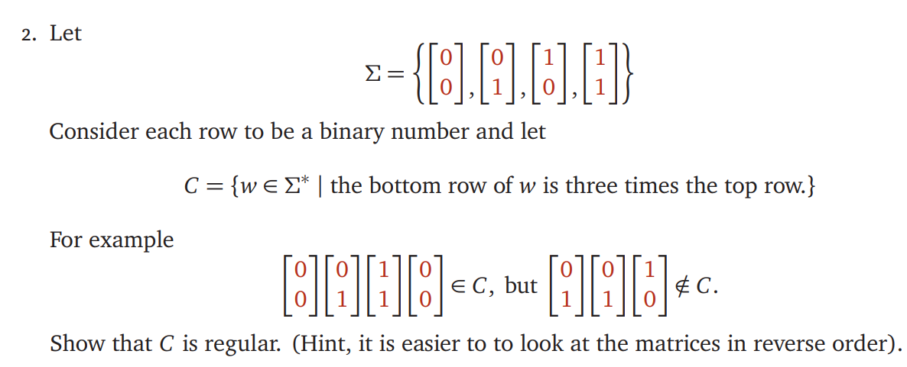
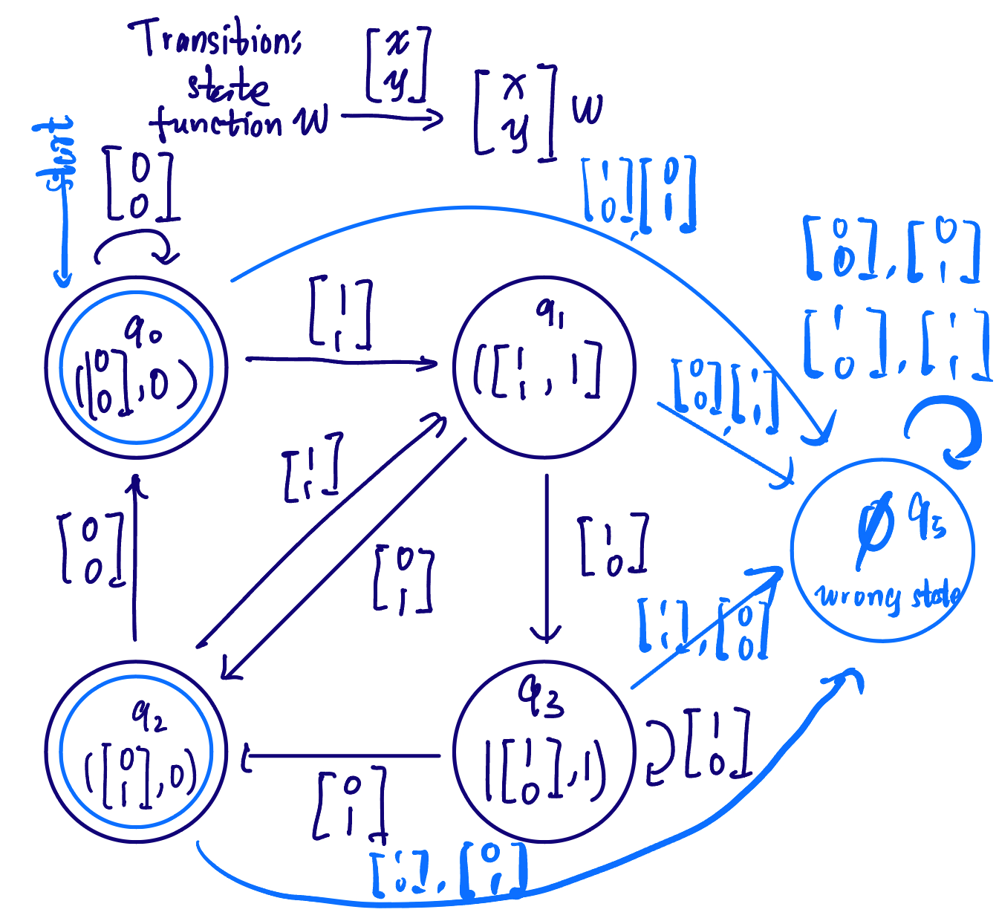

# ECE374 Assignment 2 

02/02/2023

**Group & netid**

*Chen Si         chensi3*

*Jie Wang        jiew5*

*Shitian Yang     sy39*

## T2：Proof of regularity

According to Lecture 5, the regularity of C is equal to it exists DFA. And this language can be recognized by a DFA as follows:

#### Inductive Definition:

1. Start with two states：

   - one col for the bottom row being 0 times the top row $$ c_0 = \{ \left[ \matrix{  0\\ 0 } \right] \} $$
   -  for the bottom row being 3 times the top row. $$ c_1 = \{ \left[ \matrix{  0\\ 1 } \right],\left[ \matrix{  1\\ 1 } \right]\} $$

2. In the NFA, we use an extra bit to record whether the transition create add-on the current states. The 
   $$
   DFA = (Q,\sum, \sigma, S, A), where \\
   Q = \{q0, q1, q2, q3,q5\} \\
   \sum = \{ \left[ \matrix{  1\\ 1 } \right],  \left[ \matrix{  1\\ 0 } \right],  \left[ \matrix{  0\\ 1 } \right],  \left[ \matrix{  0\\ 0 }  \right]\}\\
   S = q0 = (\left[ \matrix{  0\\ 0 }  \right],0) \\
   A = \{q0,q2\}
   $$
   $\sigma\ is\ shown\ on\ the\ picture[ 1]$, all the else are $\epsilon-reach$ to wrong state. 

   For each binary digit in the top row, the state changes according to the transition function shown below: 

   

   

   ​										Picture[1] : DFA of the Language C

   

   For instance, the following transition carry on 1 , and further operation can cancel the 1 to 0. 
   $$
   \{ \left[ \matrix{  0\\ 0 } \right]\}
     \stackrel{\mathrm{\left[ \matrix{  1\\ 1 } \right]}}{→} 
    \{ \left[ \matrix{  1\\ 1 } \right]  \left[ \matrix{  0\\ 0 }  \right]\}
   $$

**In the DFA, we look at the matrices in reverse order,** starting with initial state c0, we take a single matrix from $\sum$,  add in front of the "matrix string", judge if there exist add-on. 

Therefore, all the cases can be included in our DFA, in other word, there exists regular language C to have bottom row is 3-times upper row.  Thus, C is regular and can be recognized by a DFA.

