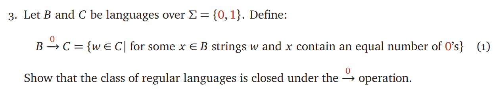

# ECE374 Assignment 2 

02/02/2023

**Group & netid**

*Chen Si         chensi3*

*Jie Wang        jiew5*

*Shitian Yang     sy39*

## T3: Proof of closure

The class of regular languages is indeed closed under the "$ \stackrel{\mathrm{0}}{→} $ " operation. 

- Given a DFA **D1** that recognizes B and a DFA **D2** that recognizes C, we can prove B can be adopted into a NFA **N1** , to include all possible string in **D2**. 

Here's how it works:

1. Based on the question, the important thing is number of 0, so **all 1-transition function can be treated as  **$\epsilon-reach $, modifying D1 into NFA N1. 

2. Then for all string in B1, we have 1 to be 1*. For example, 
   $$
   101001 \rightarrow 1^*01^*001^*
   $$

3. Therefore, the 0's in N1 can be treated as subsequence, and the language C, D2 can be connected to N1. There must exists some x in **N1** can also be recognized as string in C. 

According to Piazza#103:

> Existence of a DFA or an NFA for a language L proves that L is regular. 
>
> For P3 you need to prove that the class of regular languages is closed under the operation.
>
> The term class here can be understood as a set. People often use terms like class, family, collection, etc to avoid confusion - You wouldn't want to say things like set of sets of sets. 

All in all, since B and C both regular, D1 and D2 can be connected using $\epsilon-reach$, transferred as N1 and N2, all string w in N2 can be expressed by some string x in N1. 

By following this construction, it can be shown that the language recognized by the new NFA  is exactly B $ \stackrel{\mathrm{0}}{→} $  C. Vice versa,  C $ \stackrel{\mathrm{0}}{→} $  B also established, this shows that the class of regular languages is closed under the"$ \stackrel{\mathrm{0}}{→} $ "operation.

​	