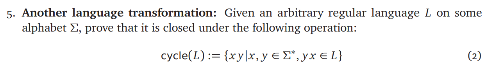

# ECE374 Assignment 2 

02/02/2023

**Group & netid**

*Chen Si         chensi3*

*Jie Wang        jiew5*

*Shitian Yang     sy39*

## T5: Another language transformation

According to the Piazza, we treat "closed" as if L is a regular language, that cycle(L) should also be regular.

Then, we construct a 