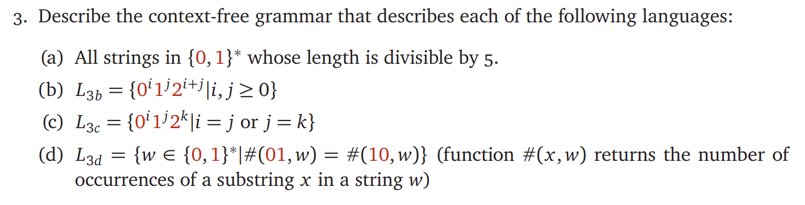

# ECE374 Assignment 3

02/01/2023

***Group & netid***

**Chen Si**  	**chensi3**

**Jie Wang** 		**jiew5**

**Shitian Yang** 	**sy39**

## T3 Context-Free Languages

### a) Divisible by 5

$$
G=\{V,T,P,S\},\\ V=\{S\},\\ T=\{0,1\} \\

P=\{
S \rightarrow \space \epsilon|\space(0+1)^5 S\space|\space(0+1)^4 S(0+1)^1\space|\\ 
\space(0+1)^3 S(0+1)^2\space|\space(0+1)^2 S(0+1)^3\space|\\ 
\space(0+1)^1 S(0+1)^4\space|\space S(0+1)^5\} \\
S = S \ \ (starting\ state\ of\ G)
$$

Because len(str) can be divisible by 5, so for each transition, it can end or add 5 numbers near it. So there are 7 situation, and each situation ensure it can be divisible by 5.

### b) $0^i1^j2^{i+j}, i,j \ge 0$

$$
G=\{V,T,P,s\}, \\V=\{S,X\}, \\T=\{0,1\} ,\\

P=\{S\rightarrow 0S2|X ,     X\rightarrow 1X2|\epsilon \}\\
S = S \ \ (starting\ state\ of\ G)
$$

To make sure #2 equals to sum of #0 and #1, we just need to add the (0 and 2 ) or (1 and 2) at the same time.

 So we add enough (0 and 2) at first, because they are outside. Then add (1 and 2) inside

### c)$0^i1^j2^{k}, i=j\ or\ j =k$

$$
G=\{V,T,P,S\},\\ V=\{S,C,D,E,F\}, \\ T=\{0,1\},\\

P=\{ S\rightarrow C|E  	   ,C\rightarrow C2|D|\epsilon,   	   D\rightarrow 0D1|\epsilon,     	 E\rightarrow 0E|F|\epsilon, 	     F\rightarrow 1F2|\epsilon\}\\
S = S \ \ (starting\ state\ of\ G)
$$

So it has two situation: i=j or j=k. If satisfy i=j, so we just add enough "2" by C, then add equal "0" and "1" by D. 

If satisfy j=k, so we just add enough "0" by E, then add equal "1" and "2" by D. 

We add the appropriate two numbers at the same time to make sure they have equal number.

### d) #01 == #10

***G={V,T,P,S}, V={S,C,D,E,F}, T={0,1}***

***P={***

$S\rightarrow \epsilon |0|1|1C1|0F0|1D01|01D0|0E10|10E1$     **starting status**

$C\rightarrow 1C|C1|0F0|\epsilon$       after 1 and before 1 (1?1)

$D\rightarrow 1D|D0|0E1|\epsilon$	  after 1 and before 0 (1?0)

$E\rightarrow 0E|E1|1D0|\epsilon$	   after 0 and before 1 (0?1)

$F\rightarrow 0F|F0|1C1|\epsilon$	   after 0 and before 0 (0?0)

***}*** 

$S = S \ \ (starting\ state\ of\ G)$

Because we need to make sure #"01" and #"10" are the same, so we separate ***P*** into **starting status and 4 small status**: 

- after 1 and before 1, 
- after 1 and before 0,
- after 0 and before 1, 
- after 0 and before 0. 

In each small status, we have two choice: 

- **do not change status:** 
  
  - for example, for C, we can add "1" before or after it, which do not change its " after 1 and before 1" status;
  
- **change status:** 

  but we need pay attention, because we need to ensure the #"01" and #"10" are the same before enter other small status, so we need to add 1 changing number before and after it.

  -  For example, for D, because it is " after 1 and before 0", so we add "0"( which is different from the "1" it after) before it, and add "1" after it, and change into the specific small status which fits the status after we add those 2 numbers.

**For starting status,** we need to ensure that: 

- the **#"01" == #"10**"  before entering other small status,
-  the status fits the requirement of the small status 
- include special cases like "0" and "1"

Therefore, we use ***1C1, 0F0, 1D01, 01D0, 0E10, 10E1*** to make sure the requirement of the small status.
