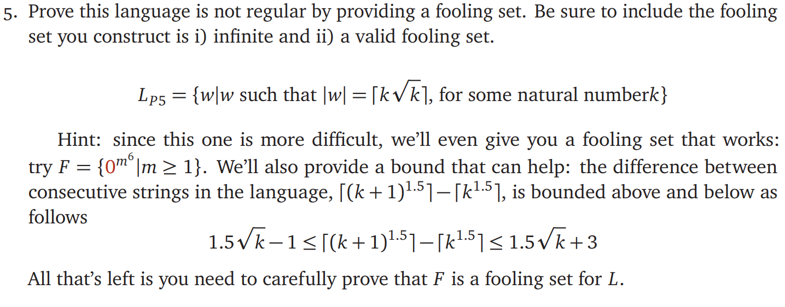

# ECE374 Assignment 3

02/08/2023

**Group & netid**

*Chen Si         chensi3*

*Jie Wang        jiew5*

*Shitian Yang     sy39*

## T5: Length Limit

## Solution:

We have fooling set $F = \{0^{m^6}|m \ge 1 \}$

Then for string w1 and w2 , let their length 
$$
|w1| = \ulcorner k^{1.5} \urcorner,k \in \{0,1,2,3,...\} \\
|w2| = \ulcorner (k+1)^{1.5} \urcorner,k \in \{0,1,2,3,...\} \\
According\ to\ hint, \\ 
1.5\sqrt{k}-1 \le |w_2| - |w_1| = difference  \le 1.5\sqrt{k} +3
$$

To prove the Fooling set is valid, we Let 
$$
x =0^{m^6},
y = 0^{n^6}, m < n
\\ |0^{m^6}| = m^6, let\ k=m^4, m^6=k \sqrt{k}
$$
Then, take **z to be a smallest string such that:**

$xz \in L, |xz|-|x|=|z|  \le 1.5\sqrt{m^4}+3$ (1)

To prove the F is valid, we assume $yz \in L, |yz|-|y|=|z| \ge 1.5\sqrt{n^4}+1$ (2)

Then, let us use scaling method to prove (2) contradicts with (1) ：
$$
\because m<n, \therefore m \le n+1 \\
\rightarrow |z| \le 1.5\sqrt{m^4}+3 \le 1.5(n+1)^2+3\\ = 1.5n^2 -3n +4.5 = 1.5n^2 -1 + (5.5 - 3n) \le 1.5n^2 -1 \\
$$
Therefore,$\rightarrow |z| < 1.5n^2 -1$, which contradicts with (2)
Then we can say the assumption is wrong, there are infinite different x and y, the size of fooling set F is infinite, we need infinite states to describe the DFA, so the language is not regular.

***Q.E.D***

