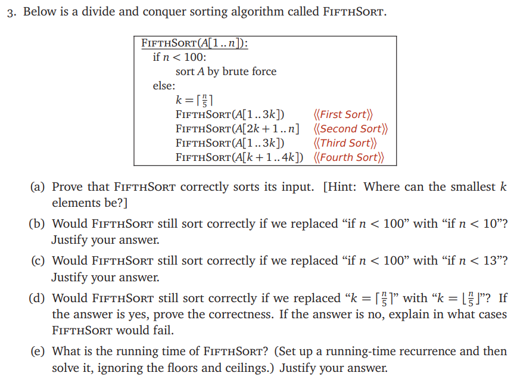
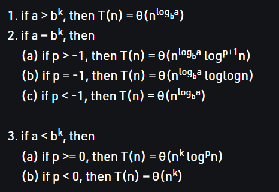
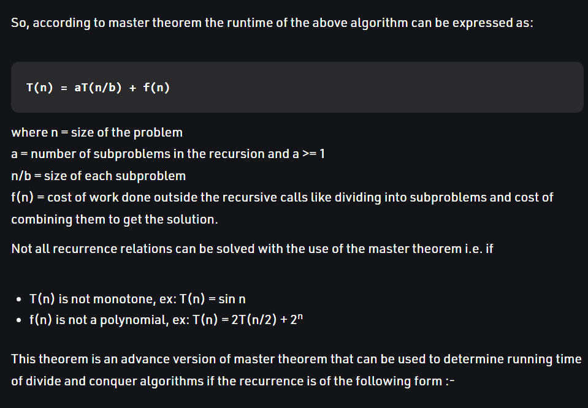

# ECE374 Assignment 4

02/28/2023

***Group & netid***

**Chen Si**  	**chensi3**

**Jie Wang** 		**jiew5**

**Shitian Yang** 	**sy39**

## T3 FifthSort

### (a) Prove correctness

(1) **Base Case:** when n < 100, it will be sorted by brute force, it should be correct

(2) **Recursive Case:** when n >= 100, each recursion uses some parts of the A[n], so the number decreases all the time, i.e, they are converging to the base case, reaching n < 100 status.

We divide A into 5 packets, each length is k, representing with the following array:

***U = [unknown,unknown,unknown,unknown,unknown]***

The ***AFTER_i*** mean the list after the **ith** sort.

- **After "first sort":**

**AFTER_1 = **

***[smallest k number in A[0:3k], middle k numbers,largest k numbers in A[0:3k],unknown,unknown]***

- **After "second sort":** 

**AFTER_2 = **

***[smallest k number in AFTER_1[0:3k], middle k numbers, smallest k number in AFTER_1[2k+1:n],middle k numbers,largest k numbers in all]***

- **After "third sort":**

**AFTER_3 =** 

***[smallest k number in all,middle k numbers,middle k numbers,middle k numbers,largest k numbers in all]***

- **After "fourth sort":**

   it sorts the middle k numbers in the list, because it has got the smallest and largest k numbers in n.

AFTER_4 = ***[Sorted Array A ]***  

### b) Base case = [1,10)

No. When n=11, it will trigger the else statement. So k=3, but in the fourth sort, 4*k=12, which overflow and will cause an error. 

### c) Base case = [1,13)

Yes, because the n<? only affect the biggest size we need to use brute force. But we need to pay attention to the overflow due to the ceil(n/5) and the fourth sort's 4k, which means 4k should smaller than n. 

Assume that

 $$ n=5m+l \ \ (0 < l \le 4),\\ \therefore 4k = 4 *ceil(n/5)= 4m+4 \le n=5m+l \Leftrightarrow 4 \le m+l $$

1. if  $  n=13: m=2,l=3, m+l>4 $

2. if $ n=14: m=2,l=4, m+l>4 $

3. if $n=15$: 

   because it is the multiple of 5, 

   so the ceil function will not trigger +1. $k=3 \Rightarrow 4k=12<15$, it is acceptable.

4. if $n>16$: so $m+l \ge m=4,$ so it is acceptable.

### d) Ceil => Floor ?

No.

Assume that there are 104 number, and the largest 24 numbers in A[1,24]. 

- After first sort, they are in A[37,60]. 
- After second sort, they are split into A[37,40] and A[85,104]. And the  A[37,40] will not have chance to be in the right place( A[81,84]), because the rest sort are sort the number from A[1] to A[80].

### e) Running Time Analysis

$T(n)=4*T(\frac{3n}{5}) +O(1)$

If we use **master theory**, so $a=4,b=5/3, a>b$

So the complexity is 

$O(n^{log_{b}{a}}) = O(n^{log_{5/3}{4}}) = O(n^{\frac{\lg(4)}{\lg(\frac{5}{3})}})\approx O(n^{2.7138})$

> Reference: [Advanced master theorem for divide and conquer recurrences - GeeksforGeeks](https://www.geeksforgeeks.org/advanced-master-theorem-for-divide-and-conquer-recurrences/)
>
> 
