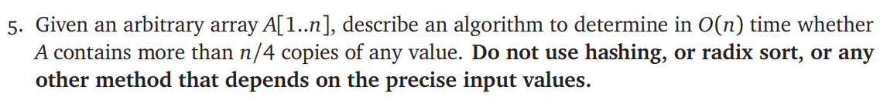
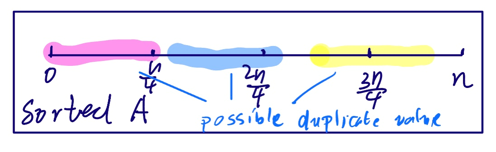

# ECE374 Assignment 4

03/03/2023

**Group & netid**

*Chen Si         chensi3*

*Jie Wang        jiew5*

*Shitian Yang     sy39*

## T5: Fast decision on repetition number



## Solution:

In order to realize an ***O(n)*** level decision algorithm, we can't sort the array, for it takes at least ***O(nlogn)*** complexity. 

However, since we don't need to specify the repeated value, we can use ***Select(A[1..n], j)*** algorithm we learnt on the course to minimize the time complexity. 

> ***Select(A[1..n], j):*** return the jth smallest value in an arbitrary array A, worst-case time complexity is ***O(n)**

The following is our algorithm on how to find the duplicate value. 

````C
#include<stdio.h>
#include <math.h>
bool ContainRepetition(A[1..n]){ 
    x[4] = [nan,0,0,0]; // leave first as nan, start from 1
	x[1] = Select(A,ceil(n/4));  // O(n)
	x[2] = Select(A,ceil(2*n/4));// O(n)
	x[3] = Select(A,ceil(3*n/4));// O(n)
    for(int i = 1; i <= 3; i++){ // 3*O(n)
        count = 0;
        for(int j = 1; j <= n;j++){
            if(A[j] == X[i]){
                count++;
            }
        }// Complexity = O(n)+O(n)+O(n)+3*O(n) = O(n) 
        if(count > n/4){
            return true;
        }
    }// If all Xi don't duplicate, there is no repetition
    return false;  
````

The ***Select*** function works as the role of "sorting", as the following diagram shows, if the repetition value exists, it will cover at least one of the there "semi points" in the sorted array. So, we just need to go through the array 3 times, judging whether there exist repetition on the 3 semi points. 



