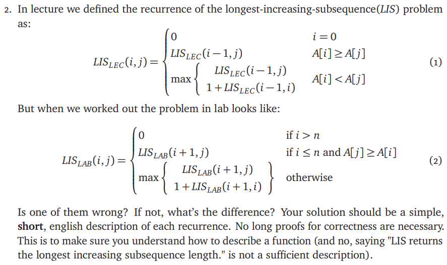

# ECE374 Assignment 4

02/28/2023

**Group & netid**

*Chen Si         chensi3*

*Jie Wang        jiew5*

*Shitian Yang     sy39*

## P2: Different LIS approach

## Solution:

**Both of them are correct. **

In fact, the $LIS_{LAB} $ is the back trace version of $LIS_{LEC}$, 

-  $LIS_{LEC}$: counting from the last to front
   -  Base case is 0, with i = 0
   -  Recursively call from largest to smallest index of the given array, only increase by one if next A[i]  < A[j], which iterates over the input sequence from right to left. 

-  $LIS_{LAB} $: counting from the front to last
   -  Base case is 0, with i > n
   -  Recursively call from smallest to largest index of the given array, only increase by one if next A[i]  < A[j], which iterates over the input sequence from left to right. 

Overall, both approaches can generate same correct result with different calculating directions. 
