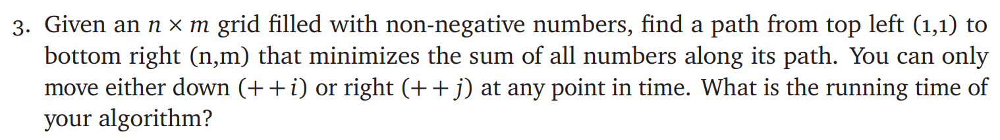

# ECE374 Assignment 5

03/19/2023

***Group & netid***

**Chen Si**  	**chensi3**

**Jie Wang** 		**jiew5**

**Shitian Yang** 	**sy39**

## P3: Grid Path Sort



| Grid  | 1    | 2    | 3    |
| ----- | ---- | ---- | ---- |
| **1** | 0    | 23   | 3    |
| **2** | 4    | 1    | 2    |
| **3** | 34   | 22   | 10   |

There is a dictionary **dic_value** contains all the non-negative numbers in n*m grid. And create **dic_route**(list) and **dic_min** to storage the min route to reach and the min value to reach to this element. We will calculate the whole grid from up to down, from left to right, and each element will inherit the smaller one from its upper or left element. 

We initial the **dic_min[1] [1]** as **dic_value[1] [1]** and **dic_route[1] [1]** as **(1,1)**. The first row will only inherit its left element, the first col will only inherit its right element. 

The solution we want is the **dic_route[n] [m]** and the **dic_min[n] [m]** which storage in the last element.

**dic_route[i] [j]**=$\cases{(1,1)&if i=j=1 \# first element\\ dic\_route[i-1][j]+(i,j)&if j=1 \#first row \\ dic\_route[i][j-1]+(i,j)&if i=1 \#first col \\  dic\_route[i-1][j]+(i,j)&if dic\_min[i-1][j]<dic\_min[i][j-1] \#inherit from left one \\  dic\_route[i][j-1]+(i,j)&if dic\_min[i-1][j]>dic\_min[i][j-1] \#inherit from upper one}$ 

**dic_min[i] [j]**=$\cases{dic\_value[1][1]&if i=j=1 \# first element\\ dic\_min[i-1][j]+dic\_value[i][j]&if j=1 \#first row\\ dic\_min[i][j-1]+dic\_value[i][j]&if i=1 \#first col \\  dic\_min[i-1][j]+dic\_value[i][j]&if dic\_min[i-1][j]<dic\_min[i][j-1] \#inherit from left one \\  dic\_min[i][j-1]+dic\_value[i][j]&if dic\_min[i-1][j]>dic\_min[i][j-1] \#inherit from upper one}$ 

```python

def min_route(dic_value,n,m):
	dic_min={}
	dic_route={}
	for i=1 to n:
		for j =1 to m:
			if  i=j=1:
				dic_min[i] [j]=dic_value[i] [j]
				dic_route[i] [j]=[(1,1)]
			if  i=1:
				dic_min[i] [j]=dic_min[i] [j-1] + dic_value[i] [j]
				dic_route[i] [j]=dic_route[i] [j-1] + [(i,j)]	
			if  j=1:
				dic_min[i] [j]=dic_min[i-1] [j] + dic_value[i] [j]
				dic_route[i] [j]=dic_route[i-1] [j] + [(i,j)]	
			if  dic\_min[i-1] [j]<dic\_min[i] [j-1]:
				dic_min[i] [j]=dic_min[i-1] [j] + dic_value[i] [j]
				dic_route[i] [j]=dic_route[i-1] [j] + [(i,j)]	
			else:
				dic_min[i] [j]=dic_min[i] [j-1] + dic_value[i] [j]
				dic_route[i] [j]=dic_route[i] [j-1] + [(i,j)]	
	return dic_route[n][m]
```


​	Because it calculates all the elements in the grid, so it is **O(n * m)**

