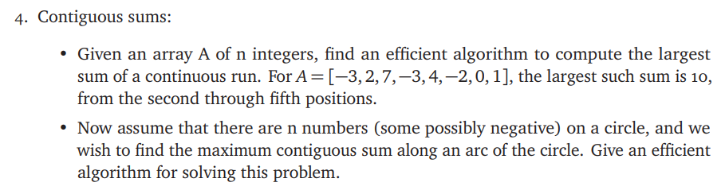

# ECE374 Assignment 4

03/03/2023

**Group & netid**

*Chen Si         chensi3*

*Jie Wang        jiew5*

*Shitian Yang     sy39*

## T4: Contiguous sums -- ***Kadane’s algorithm***



## Solution: 

#### (a) Linear case

- **Intuition**: The idea is to maintain a variable ***max_so_far*** that stores the largest sum of current read run through the array. 
- **Edge case**: Similar to ***LIS***, this algorithm can be realized in ***O(n)*** time, because it will end after reading the whole array. 
- **Inductive formula**: described in following algorithm:

````python
def LinearContiguousSum(A[1..n]):
    max_so_far = max_ending_here = A[1]
    for i in range(1, len(A)):
        max_ending_here = max_ending_here + a[i] # Tmp value for updating
        if (max_so_far < max_ending_here):
            max_so_far = max_ending_here
 
        if max_ending_here < 0: # Avoid the negative updated value
            max_ending_here = 0
    return max_so_far
````

**Time Complexity:** O(N)
**Auxiliary Space:** O(1)

#### (b) Circular case 

To handle the circular case, we need to consider two situations:

1. **The maximum sum is entirely within the non-circular array.**

   In this case, we can simply use the above algorithm to find the maximum contiguous sum for the non-circular array.

2. **The maximum sum wraps around the circular array.**

   In this case, we can invert the sign of each element in the array and apply the above algorithm to find the minimum contiguous sum for the non-circular array. We can then subtract the minimum contiguous sum from the sum of all elements in the array to get the maximum contiguous sum for the circular array.

   ```python
    def LinearContiguousSum(A[1..n]):
       # Situation One
       max_so_far = max_ending_here = A[1]
       for i in range(1, len(A)):
           max_ending_here = max_ending_here + a[i] # Tmp value for updating
           if (max_so_far < max_ending_here):
               max_so_far = max_ending_here
    
           if max_ending_here < 0: # Avoid the negative updated value
               max_ending_here = 0
       non_circular_max = max_so_far  
       # Situation Two
       total_sum = sum(A)
       for i in range(len(A)):
           A[i] = -A[i]  # invert sign of each element
       max_so_far = max_ending_here = A[1] # Reset initial value
    
       for i in range(1, len(A)):
           max_ending_here = max(A[i], max_ending_here + A[i])
           max_so_far = max(max_so_far, max_ending_here)
       circular_max = total_sum + max_so_far
       
       # return maximum of non-circular and circular max
       return max(non_circular_max, circular_max)
   ```

   

### Reference:

> [Largest Sum Contiguous Subarray (Kadane's Algorithm) - GeeksforGeeks](https://www.geeksforgeeks.org/largest-sum-contiguous-subarray/)