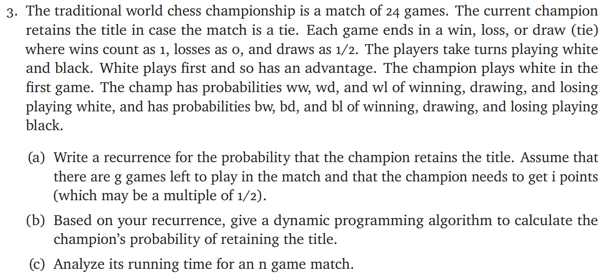

# ECE374 Assignment 6

23/03/2023

***Group & netid***

**Chen Si**  	**chensi3**

**Jie Wang** 		**jiew5**

**Shitian Yang** 	**sy39**

## T3 Chess Champion 



### a) **Recurrence Relationship**

To solve this problem, we need to calculate the **likelihood** of the each game win k score. 

And at the end, we just sum all the probability that in gth that win equal or more than i scores.

So we create a grid by using round as row and score as col. 

Each element, for example (g round,i score), will inherit from its previous round's 3 elements:

``` C
(g-1 round,i-1 score), (g-1 round,i-0.5 score), (g-1 round,i score)
```

Then we represent **"win, draw, loss"**  with "**1, 0.5 ,0**" score based on previous round.

To consider the black and white status, we create a probability list

$p_{status}=[[ww,wd,wl],[bw,bd,bl]]$ to store the the champion's probability of playing white or black .


The base case is: 
$$
P[status][1][0]=p_{status}[status][2]
\\P[status][1][0.5]=p_{status}[status][1]
\\P[status][1][1]=p_{status}[status][0]
\\P[status][1][others]=0
$$

The meaning of **P** is $P[white ~~or~~ black][round][score]$, status is 0 or 1. 0 represents white, 1 represent black. The base case represent the probability situation after the first game.


The recurrence is:
$$
\begin{aligned}
P[status][g][i]&= p_{status}[!status][0]*P[!status][g-1][i-1]
\\&~~~~+p_{status}[!status][1]*P[!status][g-1][i-0.5]
\\&~~~~+p_{status}[!status][2]*P[!status][g-1][i]
\end{aligned}
$$
This represent it inherits from its previous round's 3 elements. We use "!" mark to change the black and white status.


So the probability  that the champion retains the title is $\sum_{k=i}^{i_{max}}P[final\_status][g][k]$

### b)**Dynamic Programming Algorithm**

Based on the intuition in (a), we designed the following DP algorithm compute the likelihood. 

```python
def findp(ww,wd,wl,bw,bd,bl):
    #create p for white and black
    p_status=[[ww,wd,wl],[bw,bd,bl]]
    
    #create a all 0s grid. row represent g, col represent score
    P=np.zeros([24,49]) #24 rows, 49 cols. each col represent 0.5 score from 0 to 24 scores
    color_flag=0 #white
    
    #base case
    P[0][0]=wl
    P[0][1]=wd
    P[0][2]=ww
    
    for row in range(1,24):
        # we have initial the first row because the base case
        
        color_flag=not(color_flag) #change black and white status
        # each element in row
        for col in range(49):
            if col-2>=0:
                #win
                P[row][col]+=p_status[color_flag][0]*P[row-1][col-2]
            if col-1>=0:
                #draw
                P[row][col]+=p_status[color_flag][1]*P[row-1][col-1]
            #loss
            P[row][col]+=p_status[color_flag][2]*P[row-1][col]
            
    return sum(P[23][24:])
   
```


### c) **Running Time Analysis**

Because we need to win more than [n/2] score to retains the title, 

we need to create a n*(2n+1) grid. And we need to traverse this grid in $O(n (2n+1)) $

And we need to calculate for each element, and the other operation is constant time.

Therefore, the overall time complexity is $O(n^2)$
