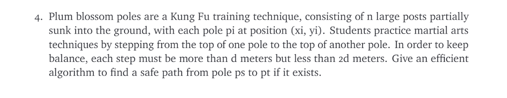

# ECE374 Assignment 6

23/03/2023

***Group & netid***

**Chen Si**  	**chensi3**

**Jie Wang** 		**jiew5**

**Shitian Yang** 	**sy39**

## T4

 

### Solution:

- The poles can be treat as a graph with n vertexes, if the **Euclidean distance** between two arbitrary poles A, B = 
  $$
  dist_{A\leftrightarrow B} = \sqrt{(x_a-x_b)^2 +(y_a-y_b)^2} \in [d,2d]
  $$
  then we say A, B is connected. 

  

For this problem, we just need to use deep first tree to find a reachable path. Because we just need to find one path is enough, and this path does not need to be the shortest one.


```python
#find a reachable path form ps to pt
def find_path(ps,pt,plist,d):
    #input:ps,pt are triple like (x,y). plist contains a list of coordinate of p, d is the distance required
    #output: a list(path) contain coordinate of p, if fail to find, it returns None
    #method:use deep first search
    
    path=help_recurrence_function(ps,pt,plist,d,[ps]) # start deep first search
    return path

# a help function to recurrence each step
def help_recurrence_function(pfrom,pto,plist,d,path):
    #input:pfrom,pto are triple like (x,y). plist contains a list of coordinate of p,
    #      d is the distance required, path is the points it has reached
    #output:path (a list of coordinates)
    #method: deep first search
    
    if OK_distance(pfrom,pto,d):
        #pto is reachable
        return path+[pto]
    else:
        #not reachable
        for p in plist:
            if not(p in path):
                #in case it goes back
                if OK_distance(pfrom,p,d):
                    #this p is reachable
                    return help_recurrence_function(p,pto,plist,pused+[p],d,path+[p])
        #no path is available from pfrom to pto, return None
        return None
                    
#Helper function:
#judge whether p2 is a appropriate next point to p1 by d    
def OK_distance(p1,p2,d):
    #input:p1,p2 are triple like (x,y), d is the distance required
    #output:reachable return 1, else return 0
    
    #judge whether p2 is a appropriate next point to p1 by d
    delta=(p1[0]-p2[0])**2 +(p1[0]-p2[0])**2
    if delta<4*d**2 and delta>d**2:
        return 1
    else:
        return 0
```


