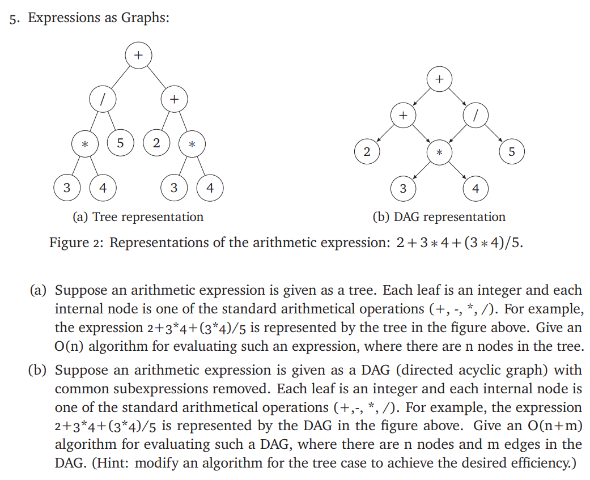

# ECE374 Assignment 6

03/23/2023

***Group & netid***

**Chen Si**  	**chensi3**

**Jie Wang** 		**jiew5**

**Shitian Yang** 	**sy39**

## P5: Graph Expression Evaluation



## Solution:

### (a) Expression Tree

To evaluate the arithmetical expression contains in the binary tree, we can perform a post-order traversal of the tree. 

Starting at the root, we work our way down to the leaves.

At each node, we recursively evaluate the left and right subtrees and apply the operation represented by the node to the results. 

- Here's the python pseudocode for the algorithm:

```python
def Tree_evaluate(Tree_t tree):
    if tree.left == None and tree.right == None: # tree is a leaf node
        return tree.value # leaf must be operand
    else: # recursively traverse 
        left_value = Tree_evaluate(tree.left)
        right_value = Tree_evaluate(tree.right)
        return Calculate(tree.value, left_value, right_value)
# Helper function
def Calculate(tree.value, left_value, right_value):
    operator = tree.value
    if operator in ['+','-','*','/']:
        if operator == '+':
            return (left_value + right_value)
        if operator == '-':
            return (left_value - right_value)
        if operator == '*':
            return (left_value * right_value)        
        if operator == '/':
            return (left_value / right_value)        
    else:
        return None 
```

Since each node is visited exactly once, the time complexity of the algorithm is ***O(n)***, where n is the number of nodes in the tree.

### (b) Expression DAG

To evaluate an arithmetic expression given as a DAG, we can use a modified version of the algorithm for the tree case. 

The key idea is to apply **topological sort** on DAG, which provides a linear order of the nodes such that if node **u->v**, there is no path **v->u**. Then we can just apply the same idea of **Tree_evaluate** function we defined in (a). 

Meanwhile, to **avoid redundant computations,** we store values of the subexpressions that we have already evaluated in a **hash table.** Whenever we encounter a node that represents a subexpression that we have already evaluated, we simply look up the value in the hash table instead of computing it again (*Dynamic Programming*).

Finally, we deal the DAG with DFS, calculating the outcome of each leaf node first and combine them together for upper operator case. 

Here's the pseudocode for the algorithm:

```python
def DAG_evaluate(DAG_t dag):
    
    value_table = {}      # a hash table to store values of subexpressions
    topo_order = topologicalSort(dag) # Use algorithm we learned on course
    value_table[topo_order.root] = None # initialize outcome as None
    # After topological sort, every child node is right of father node
    # So we just need to compute from leaf to root
    Loop node from topo_order.right to left:
        if node is a leaf:
        	value_table[node] = node.value # leaf must be operand
    	else: # recursively traverse 
        	if node in value_table: # skip stored subexpressions
            	continue  
            left_child, right_child = dag[node].left, dag[node].right
            # Based on topological sort outcome
            left_value  = value_table[left_child]
            right_value = value_table[right_child]
          	
            value = Calculate(node.value, left_value, right_value)
            value_table[node] = value
    return value_table[root_node]

```

- **Time complexity** : ***O(n+m)***

  - n is the number of nodes and m is the number of edges in the DAG. 

  - The topological sort takes ***O(n+m)*** time
  - each node is visited exactly once during the traversal. 

  - The time complexity of looking up a value in the hash table is O(1) on average. 

  Therefore, the overall time complexity is ***O(n+m).***


