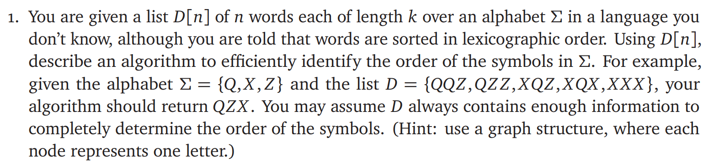
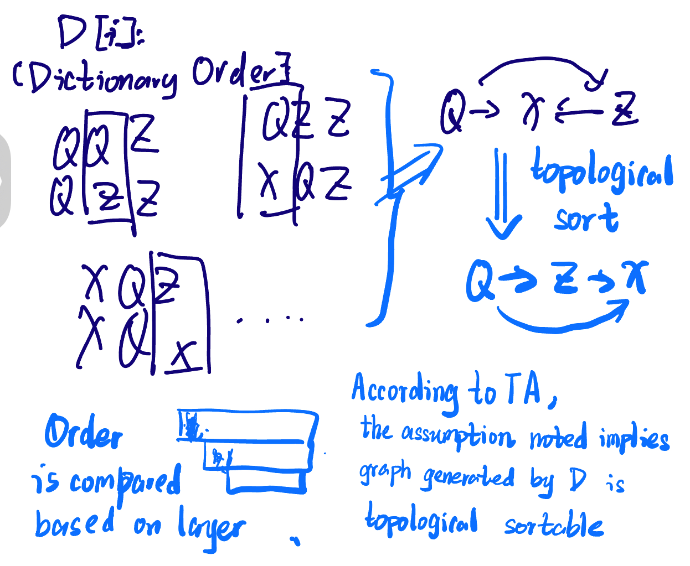

# ECE374 Assignment 7

03/29/2023

***Group & netid***

**Chen Si**  	**chensi3**

**Jie Wang** 		**jiew5**

**Shitian Yang** 	**sy39**

## P1: Topological Sort on Language



### Solution:

#### Intuition

To efficiently identify the order of the symbols in Σ using the given list D[n] of words, we can apply topological sort on a directed graph.

1. Initialize an empty directed graph G with nodes for each unique character in Σ.
2. Iterate through the list D[n], comparing adjacent words. For each pair of adjacent words, find the first character that differs between the two words.
3. Create a directed edge in the graph G from the differing character in the first word to the differing character in the second word. This edge indicates that the first character comes before the second character in the lexicographic order.
4. Perform a topological sort on the directed graph G. This will provide a linear ordering of the nodes in the graph, which corresponds to the lexicographic order of the characters in Σ.



#### Algorithm:

```python
def find_lexicographic_order(alphabet, words):
    G = create_graph(alphabet, words) # create a graph based on alphabet and words
    visited = set()
    sorted_chars = deque()
    stack = Stack(G) # Construct a stack based on Graph
 
	while stack is not None: # Toplogically traverse the whole vertex set
        char = stack[-1]
        if char not in visited:
            visited.add(char)
            for neighbor in G[char]:
                if neighbor not in visited:
                    stack.append(neighbor)
        else:
            stack.pop()
            sorted_chars.appendleft(char)
	ans_string = deque_to_string(sorted_chars)  # the question needs string format
    return ans_string
# Helper function
def create_graph(alphabet, words):
    graph = {char: set() for char in alphabet}
    for i in range(len(words) - 1):
        word1, word2 = words[i], words[i+1]
        for char1, char2 in zip(word1, word2):
            if char1 != char2:
                graph[char1].add(char2)
                break
    return graph

alphabet = {'Q', 'X', 'Z'}
words = ['QQZ', 'QZZ', 'XQZ', 'XQX', 'XXX']
order = find_lexicographic_order(alphabet, words)
print(order)

```

#### Time Complexity: O(nk)

- Creating Graph: **O(n*k) **  where n is the number of words and k is the length of each word

- Topological Sort: **O(V+E)**, where V is the number of vertices in the graph (i.e., the number of distinct characters in the words) and E is the number of edges in the graph.

  - The while loop in `find_lexicographic_order` executes once for each vertex in the graph, so the time complexity of the loop is O(V). 

  - In each iteration of the loop, we iterate over the neighbors of the current vertex, which takes O(deg(v)) time, where deg(v) is the degree of vertex v (i.e., the number of neighbors of v). 
  - The sum of the degrees of all vertices is equal to twice the number of edges in the graph, so the total time spent iterating over neighbors is O(E).

Here, based on the assumption of question, we know the alphabet size won't affect the O(n\*k), because the input sequence must provide enough information.  Then, the $|\sum| $, O(E), O(V) is within O(n) level complexity. 

In practice, the topological sort complexity may be dominated by the time spent in `create_graph` if the number of words and/or the maximum length of a word are very large.

Total time complexity is within ***O(n\*k)***

### Reference

> 1. lexicographic order: 
>
> Also known as dictionary order, or alphabetical order, is a method of ordering a set of strings or sequences based on the order of individual elements within the sequences. This order is usually based on an underlying order of the elements' alphabet or set.
>
> 2. Lab14
