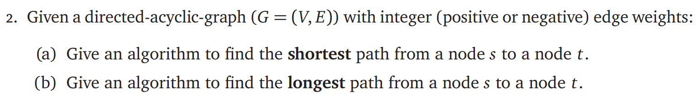

# ECE374 Assignment 7

03/29/2023

***Group & netid***

**Chen Si**  	**chensi3**

**Jie Wang** 		**jiew5**

**Shitian Yang** 	**sy39**

## P2: DAG Path Search



### Solution:

#### (a) Shortest path search

To find the shortest path from a node s to a node t in a directed acyclic graph (DAG) with integer edge weights, we can apply topological sort on the DAG, then finding the path. 

##### Intuition

1. Perform a topological sort of the graph to obtain a linear ordering of its vertices.
2. Initialize a dictionary or array dist to store the shortest distance from the source node s to all other nodes, and set the initial distance from s to itself as 0. Set the distance to all other nodes as infinity.
3. Iterate through the nodes in the topologically sorted order. For each node, relax its outgoing edges by updating the distance to its neighbors if the new path is shorter than the previously known distance.
4. Return the shortest distance from node s to node t.

##### Python implementation

```python
from collections import defaultdict

def topological_sort(graph):
    visited = set()
    sorted_nodes = []
    
    def visit(node):
        if node not in visited:
            visited.add(node)
            for neighbor in graph[node]:
                visit(neighbor)
            sorted_nodes.append(node)
            
    for node in graph:
        visit(node)
        
    return list(reversed(sorted_nodes))

def shortest_path(graph, weights, s, t):
    sorted_nodes = topological_sort(graph)
    dist = {node: float('inf') for node in graph}
    dist[s] = 0
    
    for node in sorted_nodes:
        for neighbor in graph[node]:
            new_dist = dist[node] + weights[node][neighbor]
            if new_dist < dist[neighbor]:
                dist[neighbor] = new_dist
                
    return dist[t]

```

##### Time complexity

- Topological Sort ***O(n + m)***
- Dijkstra Algo ***O(m\*log(n))*** 
- So the total Complexity is ***O(m\*log(n))*** 

#### (b) Longest path search

##### Intuition

To find the longest path from a node s to a node t in a directed acyclic graph (DAG), we can simply modify the shortest path algorithm as follows:

1. Negate all edge weights in the graph.
2. Use the modified shortest path algorithm to find the shortest path from s to t in the graph with negated edge weights.
3. Negate the result of the modified shortest path algorithm to obtain the longest path length.

#### Python implementation

```python
def longest_path(graph, weights, s, t):
    negated_weights = {node: {neighbor: -weight for neighbor, weight in neighbors.items()} for node, neighbors in weights.items()}
    return -1*shortest_path(graph, negated_weights, s, t)

```
##### Time complexity

***O(m\*log(n))*** 

### Appendix

1. Main program for testing:

   ```python
   graph = {
       'A': ['B', 'C'],
       'B': ['D'],
       'C': ['D', 'E'],
       'D': ['F'],
       'E': ['F'],
       'F': []
   }
   
   weights = {
       'A': {'B': 3, 'C': 2},
       'B': {'D': 4},
       'C': {'D': 3, 'E': 1},
       'D': {'F': 2},
       'E': {'F': 3},
       'F': {}
   }
   
   s, t = 'A', 'F'
   shortest = shortest_path(graph, weights, s, t)
   longest = longest_path(graph, weights, s, t)
   
   print("Shortest path:", shortest)
   print("Longest path:", longest)
   
   ```

   

