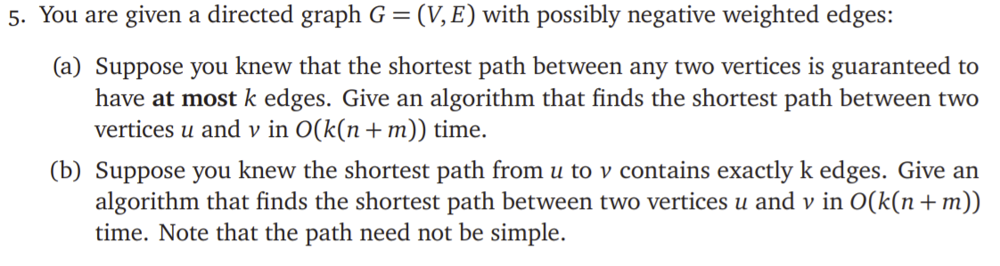

# ECE374 Assignment 7

03/30/2023

***Group & netid***

**Chen Si**  	**chensi3**

**Jie Wang** 		**jiew5**

**Shitian Yang** 	**sy39**

## T5 k-length-path


### Solution
#### (a) at most k case

#### Intuition:

Here we choose to use **Bellman-Ford algorithm** to find the shortest path.    

- We need V_list and E_list from G, two dictionary: ***dic_min_path_value*** and ***dic_min_path***, start point s, end point t and number k.

- The **dic_min_path_value[i]** stores the distance from s to i, which is used to check and update the **dic_min_path[i]**. 

- The **dic_min_path**[i] stores the path from s to i, and it will be updated when find a smaller distance path.

At first, we need to initial all the **dic_min_path_value** to $\infin$ except the **dic_min_path_value**[s], because it is the start point. And initial the **dic_min_path[s]=[s]**. 

- Then we will read the **E_list k** times, each time we will do:

1. get the edge (u,v,w), w is the weight of this edge.

2. if dic_min_path_value[v] > dic_min_path_value[u] + w, 

   then: dic_min_path_value[v] = dic_min_path_value[u] + w 

   ​           dic_min_path[v] = dic_min_path[u]+[v]

After k times, we return the **dic_min_path_value[t]** and **dic_min_path[t],** which means the min distance and min path from s to t.

#### Algorithm

```python
import math
def Bellman_Ford(V_list,E_list,s,t,k):
    dic_min_path_value={}
    dic_min_path={}
    #init
    for node in V_list:
        dic_min_path_value[node]=math.inf
    dic_min_path_value[s]=0
    dic_min_path[s]=[s]
    
    #k times loop
    for ki in range(k):
        for edge in E_list:
            u=edge[0]
            v=edge[1]
            w=edge[2]
            if dic_min_path_value[v]>dic_min_path_value[u]+w:
                dic_min_path_value[v]=dic_min_path_value[u]+w
                dic_min_path[v]=dic_min_path[u]+[v]
                    
    return dic_min_path_value[t],dic_min_path[t]
```

#### Time complexity

Because we use n to initial and k*m in the loop. So it is **O(n+k * m)** which is equivalent to **O(k(n+m)).**

#### (b) Exactly k case

##### Approach 1

> Our team have communicate with TA and prof on this subquestion. 
>
> After analyzing the question for long time, we believe based on current question statement on (a) and (b), we can use the same algorithm.
>
> Because: (b) makes an assumption that **we can always find a shortest path length is k**, And based on bell-man algorithm, the path will always be simple (the one we learned during the course don’t need to go over the same vertex mulitple times).
>
> Let us use # to represent the # of edges need to find correct path.
>
> For (a):
>
> - \# <= k <= m
>
> For (b):
>
> - \# == k <= m
>
> I guess, there is a internal conflict within the statement of (b). The professor may want to test us the case we need to do extra steps in shortest path build.
>
> For instance, the k = m - 1 , then we must go over a *long* path from u->v. But this violates the statement that path is always shortest.
>
> 

Based on the discussion above, we know:

- The k-length path is ensured to exist in the graph
- We can simply use same algorithm as the first question's answer
- Time Complexity = **O(n+k * m)** 

##### Approach 2

Based on the first approach, we have a simpler answer. 

In this case, we do not care about the weight of each edge. 

- So we can use modified DFS to search the k-path node. 

- We allow the algorithm to go back, and just limit the number of paths it passed by decrease the k in each recursion. 
- So it will only run k times and make sure the ending point is t, or it will return nothing.

```python
def modified_dfs(V_list,E_list,s,t,k):
    if k==0:
        if s==t:
            #this k level node is t! finish
            return [t]
        else:
            #this k level node is not t.
            return None
    else:
        for every edge start from s:
        	path=modified_dfs(V_list,E_list,edge[1],t,k-1)
            if path!=None:
                #Because it must have one k distance path as the question
                #we do not need to consider the situation it cannnot find a path
               return [s]+path

            
```

Compared with the original DFS which is O(n+m), this algorithm will at most visit each node or edge k times. So the complexity is **O(k(n+m))**.
