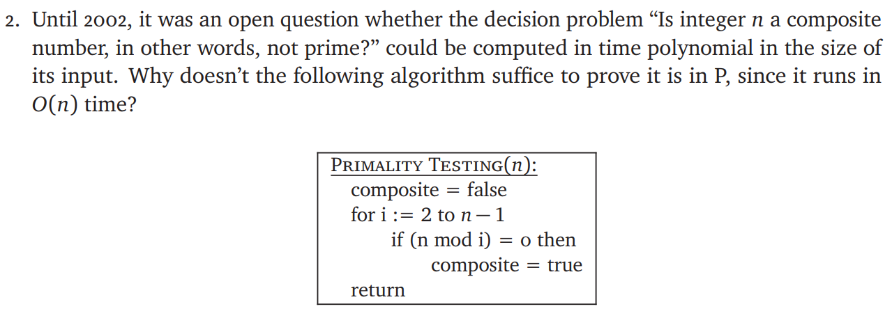

# ECE374 Assignment 8

04/14/2023

***Group & netid***

**Chen Si**  	**chensi3**

**Jie Wang** 		**jiew5**

**Shitian Yang** 	**sy39**

## T5 k-length-path

### Solution

Actually the "in the size of its input" is not the "n". 

Assume the size of its input is k, then n$\approx t^k$ if the number is stored in "t" base. 

So the true time complexity is O($t^k$) which is not  polynomial.