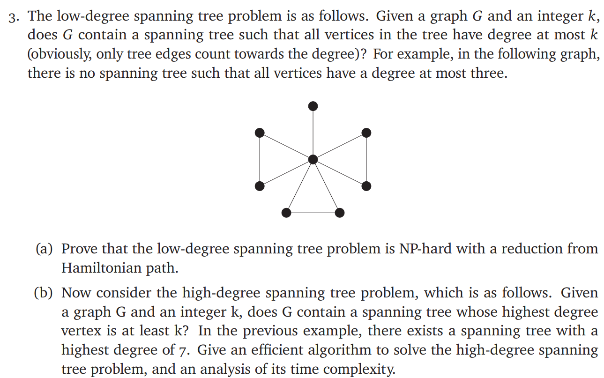

# ECE374 Assignment 8

04/14/2023

***Group & netid***

**Chen Si**  	**chensi3**

**Jie Wang** 		**jiew5**

**Shitian Yang** 	**sy39**

## T5 k-length-path

### Solution

### (a) NP-hard proof

Constructions: 

1) For Hamiltonian path graph **H**, we create some groups. Each group represent a vertex in **G**. There are **k** vertexes in a group, and they are complete connected with each other in this group.
2) Two groups are connected means all the vertexes in this two group are complete connected with each other. And the connection between two group means the edge in **G**

So the graph **G** have spanning tree that have degree at most **k** if and only if there is Hamiltonian path in **H**

#### Hamiltonian path  $\Rightarrow$  Spanning tree: 

1) All the vertexes in **G** are connected, because Hamiltonian path will go through all the groups

2) If there is a cycle in groups in **H**, we can cut one of the edge in the cycle, so that the new graph **G** has not cycle
3) Because each group only has k vertexes, so the path only can get in or get out **k** times, or it will use repetitive vertex.

#### Spanning tree $\Rightarrow$ Hamiltonian path:

1) Just follow the constructions to expand each vertex to a k-vertex-group and create the edges between groups
2) It will has a Hamiltonian path. Because if a vertex in the spanning tree has **n** edges, then the Hamiltonian path  can pass the group which represent this vertex k times. **n**<=**k**, so there is a Hamiltonian path.

Given **G**, we can easily construct **H** in polynomial time by brute force.

### (b) 

For **G(V,E)**, let |**V**|=**n**,|**E**|=**m**. First we search all the vertexes to find the vertexes with max degree, which use **O(n+m)**. Then we do **BFS** by using this vertex as the root. **BFS**  will use all edges of this vertex to ensure max degree vertex of spinning tree is same to the degree of this vertex. And the **BFS** use **O(n+m)**.

So the total cost is **O(n+m)**.