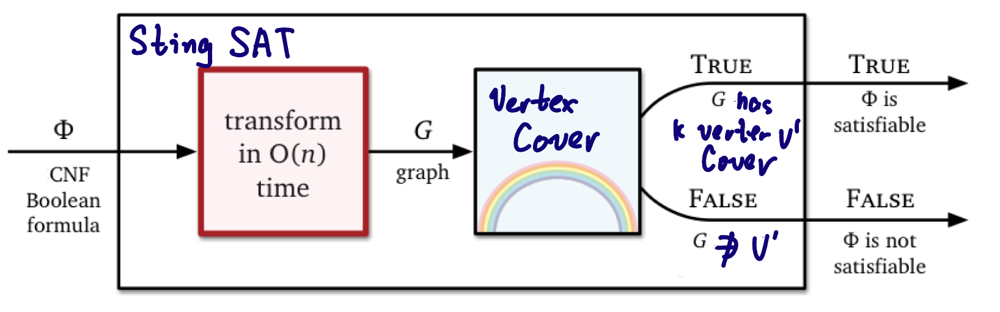

# ECE374 Assignment 8 

# T4 SAT-related Problems

04/14/2023

***Group & netid***

**Chen Si**  	**chensi3**

**Jie Wang** 		**jiew5**

**Shitian Yang** 	**sy39**

[toc]

## (a) Stingy SAT: at most k true variables

Stingy SAT is the following problem: given a set of clauses (each a disjunction of literals) and an integer k, find a satisfying assignment in which **at most k variables are true,** if such an assignment exists. 

**Prove that stingy SAT is NP-hard.**

### Approach 1

Since there is a **=< k limitation** on the SAT problem, we can use **Vertex Cover** to show it is NP-hard.

> Vertex Cover problem : 
>
> given an undirected graph G = (V, E) and an integer k, find a subset of vertices V' ⊆ V such that |V'| <= k and every edge in E has at least one endpoint in V'.

#### Reduction Construction

We will now construct an instance of the ***Stingy SAT*** problem from the given instance of the Vertex Cover problem:

1. For each vertex **v** in **V**, create a corresponding Boolean variable **x_v** in the Stingy SAT instance. 
   - If ***v $\in $ Vertex Cover set V', x_v = True***, else False
2. For each edge **(u, v)** in **E**, create a clause **(x_u OR x_v)** in the Stingy SAT instance.

Now, we have a set of clauses and an integer k for the Stingy SAT problem.

We claim that G has a vertex cover of size k or smaller if and only if the constructed set of clauses has a satisfying assignment in which at most k variables are true.

#### Vertex cover $\Rightarrow$ Stingy SAT

- If G has a vertex cover V' of size k or smaller, assign each variable **x_v** to true if and only if the corresponding vertex v is in the vertex cover V'. 
- Because for each edge **(u, v)** in E, at least one of **x_u or x_v** will be true, as at least one of the vertices u or v $\in$ V'. 
- Since |V'| <= k, at most k variables are true, then the construction satisfy all clauses in Stingy SAT. 

Therefore, the constructed yes-instance of Vertex Cover can be treated as the yes-instance of Stingy SAT.

#### Stingy SAT $\Rightarrow$ Vertex cover 

- If the constructed set of clauses has a satisfying assignment in which at most k variables are true, we can form a vertex cover V' by including vertex v in V' if and only if the corresponding variable x_v is true. 
- This set V' is a vertex cover because for each edge (u, v) in E, the clause (x_u OR x_v) is satisfied by transferring the clause into form of ***(x_v,x_u)*** , meaning that at least one of x_u or x_v is true, and thus, at least one of the vertices u or v is in V'.
- Since at most k variables are true, |V'| <= k, the vertex cover is satisfied. 

Therefore, arbitrary yes-instance of Stingy SAT can be transferred into a special yes-instance of Vertex Cover. 

#### Conclusion

The reduction from Vertex Cover to Stingy SAT can be done in polynomial time.

Since Vertex Cover is NP-complete, this reduction shows that Stingy SAT is NP-hard.

### Approach 2

SAT is also a good choice to do reduction, the intuition idea is to set a boundary k help to decide satisfaction. 

#### Reduction Construction

Given an instance of SAT ***f*** with **k** variables, we can construct an instance of Stingy SAT ***(f,k)*** 

Now, we claim that the special SAT instance is satisfiable **if and only if** the constructed Stingy SAT instance has a satisfying assignment with at most k variables set to true.

#### SAT $\Rightarrow$ Stingy SAT

- If the SAT instance *f* is satisfiable, then there exists a satisfying assignment of Boolean values to the variables. We can use this assignment for the Stingy SAT instance. 
- Since at most k variables are set to true, this assignment is a valid solution for the Stingy SAT instance.

Therefore, the constructed yes-instance of SAT can be treated as the yes-instance of Stingy SAT.

#### Stingy SAT  $\Rightarrow$  SAT

- For any given Stingy SAT instance, it will always satisfy the assignment of instance f for SAT, by SAT definition. 

Therefore, arbitrary yes-instance of Stingy SAT can be transferred into a special yes-instance of SAT. 

#### Conclusion

The reduction from SAT to Stingy SAT can be done in polynomial time. 

Since SAT is NP-complete, this reduction shows that Stingy SAT is NP-hard.

## (b) Double SAT problem

The Double SAT problem asks whether a given satisfiability problem has at least two different satisfying assignments. 

- For example, the problem $ \{\{v_1, v_2\}, \{\overline{v_1}, v_2\}, \{\overline{v_1},\overline{v_2}\}\} $is satisfiable,but has only one solution $(v_1 =F,v_2 =T)$. 

- In contrast, $\{\{v_1, v_2\}, \{\overline{v_1},\overline{v_2}\}\} $ has exactly two solutions. 

**Show that Double-SAT is NP-hard.**

#### Intuition:

To prove the Double-SAT is NP-hard, we can reduce the **SAT problem** to it. 

#### Reduction Construction

Given a CNF function ***g*** then create a Boolean function **f** by adding a pair of literals  **(x $\or \ \neg$ x)**   to each clause of ***f***, where **x** is an additional variable. This reduction can work in polynomial time.

$f = g  \and  (x \or \neg x)$

Now, we claim that the SAT instance is satisfiable if and only if the constructed Double-SAT instance has at least two different satisfying assignments.

#### SAT $\Rightarrow$ Double SAT

- If the SAT instance ***g*** is satisfiable, there exists a satisfying assignment of Boolean values to the variables. 
- We can use this assignment for the Double-SAT instance and set **x to both true and false** to get two different satisfying assignments, for  **(x $\or \neg$ x)**  won't affect the final outcome of assignment
- On the contrary, If **g** is unsatisfiable, then some clause of **g** must be **FALSE**, and therefore, ***f*** must also be unsatisfiable.

Therefore, the constructed yes-instance of SAT can be treated as the yes-instance of Double SAT.

#### Double SAT  $\Rightarrow$  SAT

- If the Double-SAT instance has at least two different satisfying assignments, we can find a satisfying assignment for the SAT instance by ignoring the variable x. 
- Therefore, arbitrary yes-instance of Double SAT can be transferred into a special yes-instance of SAT. 

#### Conclusion

The reduction from SAT to Double-SAT can be done in polynomial time. Since SAT is NP-complete, this reduction shows that Double-SAT is NP-hard.