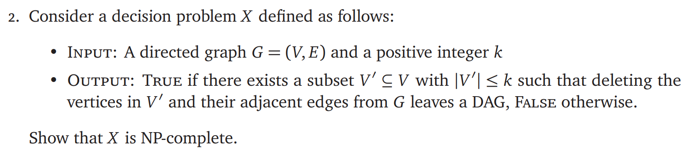
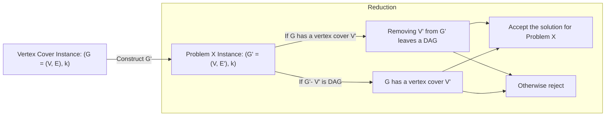

# ECE374 Assignment 9

04/19/2023

***Group & netid***

**Chen Si**  	**chensi3**

**Jie Wang** 		**jiew5**

**Shitian Yang** 	**sy39**

## Proof of NP

To prove X is in NP, we need to show that there exists a non-deterministic algorithm that can verify the existence of subset ***V'*** satisfying **G-V' is a DAG**

### Certificate: 

- Set $S \subseteq V$

### Certifier: 

- Check $ | S| \le k$, if not, reject certificate
- Construct $G' = G - S$, removing the corresponding edges 
- Run topological sort on ***G'*** , see if it is a DAG. If a topological sort is possible, accept the **S**. Otherwise, reject it. 

The above verification algorithm runs in polynomial time with respect to the number of vertices and edges since the topological sort can be performed in O(|V| + |E|) time. 

Since there exists a polynomial-time verification algorithm for X, the problem is in NP.

## Proof of NP-hard

Since there is a **=< k limitation** on the X, we can use **Vertex Cover** to show it is NP-hard.

> Vertex Cover problem : 
>
> given an **undirected** graph G = (V, E) and an integer k, find a subset of vertices V' ⊆ V such that |V'| <= k and every edge in E has at least one endpoint in V'.

#### Reduction Construction

We will now construct an instance of the problem **X** from the given instance of the Vertex Cover problem:

**VC Instance: {G=(V,E), k}**, G is undirected graph

- **X Instance:  {G'=(V,E'), k} **
  - Create a directed graph G' from G by replacing each undirected edge (u, v) in E with two directed edges (u, v) and (v, u). Thus, **G' = (V, E').**

#### Vertex cover $\Rightarrow$ X

- If G has a vertex cover V', then every edge in G has at least one endpoint in V'. 
- Consequently, in G', removing the vertices in V' and their adjacent edges will leave no directed edges between the remaining vertices, resulting in a DAG.

Therefore, the constructed yes-instance of Vertex Cover can be treated as the yes-instance of X.

#### X $\Rightarrow$ Vertex cover 

- if there exists a subset V' in G' such that deleting the vertices in V' and their adjacent edges leaves a DAG, then V' must cover every directed edge in G'. 
- Since each undirected edge in G corresponds to two directed edges in G' (one in each direction), V' also covers every edge in G and is a valid vertex cover.

Therefore, arbitrary yes-instance of X can be transferred into a special yes-instance of Vertex Cover. 

#### Conclusion

The reduction from Vertex Cover to X can be done in polynomial time.

Since Vertex Cover is NP-complete, this reduction shows that X is NP-hard.

## Summary

Since X is in NP and X is NP-hard, we can draw a conclusion that X is NP-complete

Q.E.D.
