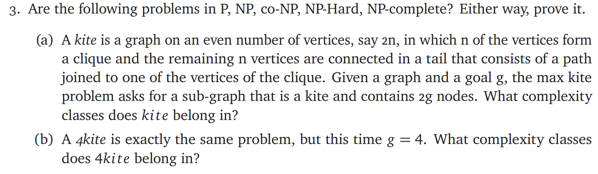
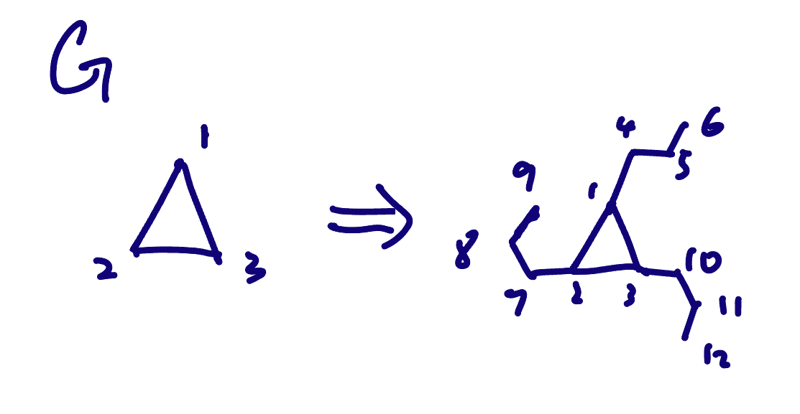

# ECE374 Assignment 9

04/20/2023

***Group & netid***

**Chen Si**  	**chensi3**

**Jie Wang** 		**jiew5**

**Shitian Yang** 	**sy39**

## 3. Algorithmic Complexity Classes



## (a) The max kite problem 

It is NP-complete. Let's first analyze the problem with respect to the complexity classes:

### The problem is in NP:
To show that the problem is in NP, we need to prove that there exists a polynomial-time verifier for the problem. 

Given an undirected graph G, goal g,

#### Certificate: 

- subgraph H

#### Certifier: 

- If $|H| \not= 2g$, reject H
- For vertex in H:
  - Search for vertex **v** with degree **1**, 
  - Starting from neighbor of **v**, exploring through **g-1** vertices, 
    - check if current vertex **u** is a middle part of tail
      - Note: a middle part of tail has degree =  2
      - If **u** is not a middle part of tail, reject
    - Check the rest part in H,
      -  if it is a clique of size g, accept, else reject. 

Since the certifier can run in NP, the **maxkite** problem is in NP.

### The problem is NP-hard:
Here we reduce **maxkite** problem to the Clique problem, to prove  it is NP-hard

> Clique Problem: Given a undirected graph G and a goal k, does G contain a clique of size k?

#### Reduction: 
Given a **YES instance of the Clique problem (G, k),** 

we can create **a YES instance of the max kite problem (G', g)** as follows:

- Set G' =  for each vertices v in G, **add a tail of k new vertices**
- Set g = k.



Now, we need to show that this reduction is correct, i.e., G has a clique of size k if and only if G' has a kite of size 2g.

#### $Clique \Rightarrow MaxKite$

- If G has a clique of size k, then G' has a clique of size g and |V| tails of size g. 

- By adding multiple isolated paths of length g to G', we can always form a kite of size 2g in G'. 
- Thus, if G has a clique of size k, G' has a kite of size 2g.\

Therefore, the constructed yes-instance of Clique can be treated as the yes-instance of MaxKite.

#### $MaxKite \Rightarrow Clique $

- If G' has a kite of size 2g, then it at least exists a clique of size g in G' and a tail of length g. 

- Since all the left parts in G' - G are tails, which can't be a max clique in G', 
- Then the size g clique in G' is exactly the max clique in G. 

Therefore, arbitrary yes-instance of MaxKite **(G', g)** can be transformed into a special yes-instance of Clique **(G, g)**, 

in which **G = G - length_g_tail**.

Since we can reduce the Clique problem (an NP-complete problem) to the max kite problem in polynomial time, the max kite problem is NP-hard.

### Conclusion

Combining the facts that the max kite problem is in NP and is NP-hard, we can conclude that the it is NP-complete.


## (b) The 4kite problem 

For the 4kite problem, given a graph G, we need to determine if there is a subgraph that is a kite with 4 vertices in the clique and 4 vertices in the tail. It solved in polynomial time, and thus belongs to the class P. Here's an algorithm to solve the 4kite problem:

### 4kite Algorithm

```pseudocode
function DEC_4Kite(G):
    for each subset S of 4 vertices from G:
        if isClique(S, G):
            for each subset T of 4 vertices in (G-S): // the 4 nodes subset not in S
                if isPath(T, G) and isConnectedToClique(T, S, G):
                    return True
    return False

function isClique(S, G):
    for each pair of vertices u, v in S:
        if u and v are not connected in G:
            return False
    return True

function isPath(T, G):
    for each vertex v in T:
        if the degree of v in the subgraph induced by T is either 1 or 2:
            continue
        else:
            return False
    return True

function isConnectedToClique(T, S, G):
    for each vertex v in T with degree 1 in the subgraph induced by T:
        for each vertex u in S:
            if u and v are connected in G:
                return True
    return False

```

1. Enumerate all possible subsets of 4 vertices from the graph G. For each subset, check if the vertices form a clique of size 4. This can be done in polynomial time, as there are O($n^4$) subsets to check, and for each subset, it takes O($4^2$) time to check if it forms a clique.

2. If a clique of size 4 is found, enumerate all possible subsets of 4 vertices outside the clique. For each subset, check if the vertices form a path of length 4. This can also be done in polynomial time, as there are O($n^4$) subsets to check, and for each subset, it takes O(4) time to check if it forms a path of length 4.

3. If a clique of size 4 and a path of length 4 are found, check if the path is connected to one of the vertices in the clique. If such a connection exists, then the graph G contains a 4kite, and the algorithm returns True. Otherwise, the algorithm returns False.

Since the algorithm runs in polynomial time, the 4kite problem belongs to the complexity class P.

